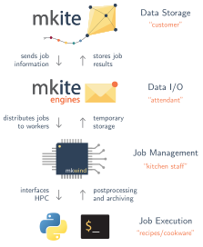

===============
How mkite works
===============

The mkite package works by separating the concerns of: (1) database management, (2) job distribution, and (3) job execution. 
Each of these functions is implemented by a separate package. 
The integration is performed by having a common schema for passing information between the different layers. 
This schema can be as simple as a JSON file with compatible fields.

An analogy with restaurants
---------------------------

An easy way to understand mkite is to look at the way restaurants typically work. In a restaurant:

- Customers often have a predefined set of dishes to choose from.
- Although customers can propose small modifications to each dish (no garlic, medium-spicy), they rarely propose new dishes.
- Customers do not need to know how the kitchen operates.
- Customers place orders with an attendant (e.g., waiter/waitress), never directly with the kitchen.
- Attendants are responsible for bringing new orders to the kitchen, and bringing dishes to customers. 
- The kitchen only communicates with the serving staff, not with customers.
- The kitchen has freedom to redistribute tasks depending on the demand.

Similarly, in high-throughput materials simulations:

- Users ("customers") have a predefined set of tasks ("recipes") to perform a given experiment.
- For each job, small variations of parameters can be proposed without having to modify the full recipe.
- Often, users do not have to know where the experiment is going to be executed (or which "chef" is going to prepare the recipe)
- Users request jobs with an intermediate engine ("attendant") that delivers the order to the worker computer ("kitchen")
- Engines are responsible for bringing job requests to worker computers, and completed jobs to users.
- Worker computeres only communicate with the engine, not with the production database where the information will be stored ("customer")
- HPC facilities available can redistribute tasks depending on the demand

This is the analogy that determines mkite's design and operation.

How mkite is organized
----------------------

The mkite suite is organized in five major blocks:

- ``mkite_core``, containing the base classes for running jobs and communicating with different parts of the package (e.g., file conversion). 
- ``mkite_db``, which provides a Django server for storing the results of calculations and orchestrating workflows in mkite.
- ``mkite_engines``, which is used to communicate jobs between the server (main database) and clients (job runners) and decouple the clients from the main database.
- ``mkwind``, the client package that interacts with local queues, builds and runs jobs, and send the results of calculations to main engines.
- plugins, which provide recipes, parsers, and builders for each software package or task to be executed.

Each of these blocks is a different Python package, enabling a separation of concerns when implementing calculations. 
This separation also enables clients to run jobs without requiring full access to a database, thus minimizing the requirements of worker servers.

How mkite is integrated
-----------------------

The mkite code is integrated with a unified data schema. 
The ``mkite_core`` package has these schemas implemented in the ``mkite_core.models`` module using the ``msgspec`` package. 
This allows for fast I/O and conversion between a JSON file and an object, while still preserving type checking.

Given the unified file formats, jobs can be created at any part of the pipeline. 
For example, a user can create a job manually by writing a JSON file in the accepted schema, and use mkite to execute that job without the need for a database. 
Similarly, several jobs can be enumerated by hand and submitted to an engine, where they will be executed by the mkwind clients. 
Finally, a production database can easily communicate with the remaining parts of the project by relying on this schema.

The interaction between the different subpackages and integration layers are illustrated in the figure below:

How mkite is configured
-----------------------

As different parts of the package rely several configuration files, mkite is integrated via (mostly) unified configuration files.
These files can be placed in a directory with version control, where all parts of mkite will attempt to load.
A few environmental variables can be used for convenience when running mkite.
Finally, arguments can be passed to commands to override defaults whenever needed.
You can learn more about the configuration files for mkite in :doc:`the Configuring section of the setup <../setup/configs>`.
