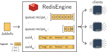

======================================
Creating, submitting, and parsing jobs
======================================

Now that we learned how to manage jobs on the client side, we can proceed to create jobs on the database side.
To make this example interesting, we will create conformers for all molecules in the `MD17 dataset from Chmiela et al. (2017) <https://doi.org/10.1126/sciadv.1603015>`_, as shown in the :doc:`quickstart guide <quickstart>`.

Preparing the database
----------------------

Start by creating a project and experiment for this project:

.. code-block:: bash

   kitedb create_project md17
   kitedb create_experiment md17 01_import

Then, add to the database all recipes based on the entry points:

.. code-block:: bash

   kitedb scanrecipes

Finally, we will add the SMILES of these molecules into the database.
Create a ``mols.yaml`` file with the contents:

.. code-block:: yaml

    - smiles: "c1ccccc1"
      attributes:
        name: benzene

    - smiles: "O=C1NC=CC(=O)N1"
      attributes:
        name: uracil

    - smiles: "c1ccc2ccccc2c1"
      attributes:
        name: naphthalene

    - smiles: "O=C(C)Oc1ccccc1C(=O)O"
      attributes:
        name: aspirin

    - smiles: "O=C(O)c1ccccc1O"
      attributes:
        name: salicylic acid

    - smiles: "O=CC=O"
      attributes:
        name: malonaldehyde

    - smiles: "CC(O)C"
      attributes:
        name: ethanol

    - smiles: "Cc1ccccc1"
      attributes:
        name: toluene

Then, use the ``kitedb`` command to import this file into the database:

.. code-block:: bash

   kitedb dbimport MolFileImporter -f mols.yaml -p md17 -e 01_conformers

Now, the ``Molecule`` objects have been imported as SMILES into the database.

Creating jobs
-------------

For each one of these molecules, we want to create a job that creates a conformer for them.
To do so, create a YAML file that contains the specification of this job.
For example, in a file named ``01_conformers.yaml``, add the job description:

.. code-block:: yaml

    - out_experiment: 01_conformers
      out_recipe: conformer.generation
      tags:
        - conformer
      options:
        num_conformers_returned: 1
      inputs:
        - filter:
            parentjob__experiment__name: 01_conformers
            parentjob__recipe__name: dbimport.MolFileImporter

In the YAML file above, we are instructing mkite to:

- Create Jobs whose experiment will be ``out_experiment`` and recipe will be ``out_recipe``.
- The new Jobs will have the tag ``conformer`` (for human readability)
- The new Jobs will have the special option ``num_conformers_returned = 1`` that will override the default ``num_conformers_returned`` of the recipe ``conformer.generation``.
- The new Jobs will have as inputs all ``ChemNodes`` (inputs are always ChemNodes) that satisfy both of the following requirements:
    - The Jobs that created each of these ``ChemNodes`` (parentjob) belong to the experiment ``01_conformers``;
    - The Jobs that created each of these ``ChemNodes`` (parentjob) have recipes ``dbimport.MolFileImporter``.

We can apply this job specification for all systems in the database that satisfy these constraints.
To do so, simply run the ``create`` command:

.. code-block:: bash

   kitedb create_from_file simple 01_conformers.yaml

If the command was successful, you would probably see the following result:

.. code-block:: text

    File 01_conformers.yaml, creator simple
    Rule 1: (01_conformers, conformer.generation)
    created 8 new jobs.

The command ``create_from_file`` adds new jobs to the database according to the template provided.
In particular, the command above reads the ``01_conformers.yaml`` file and creates the template based on the database status.
The use of the creator ``simple`` means that one job is created per input.
Other strategies are available and are discussed in the advanced guide.

.. tip::

   You can check the status of the database at any moment by using the Django shell.
   To activate it, use the ``kitedb shell_plus`` command.

Submitting jobs
---------------

Once the jobs have been created in the database, they can be submitted for execution in a remote worker.
As the main database keeps track of all the jobs and results from calculations, the requirement is to submit only jobs that have not been submitted nor performed before.

.. figure:: _img/mkite-submit.svg
    :align: center
    :alt: interface between mkite and engine
    :class: figtextwidth
    :width: 70%

.. tip::

   Jobs generated with the ``create_from_file`` and ``create`` command in mkite are added to the database with status ``READY`` by default.
   This means that the job is waiting for execution.

The command ``submit`` finds all jobs that are marked as ``READY``, serializes them, and sends them to a given engine.

Submitting to a local engine
^^^^^^^^^^^^^^^^^^^^^^^^^^^^

To submit a job to a folder that is monitored by mkwind (local engine), create an ``engine.yaml`` like we did in the `mkwind tutorial <mkwind>` to describe where the jobs will be submitted to:

.. code-block:: yaml
    :caption: ``engine.yaml``

    _module: mkite_engines.local
    root_path: ${_self_}/jobs
    move: True

The description above says that new jobs are going to be created in the ``jobs`` folder in the same directory as the ``engine.yaml`` file.
For now, this means that all our folders will be lumped in the same directory.
While this helps our tutorial to be easier, it is undesirable in production, when you should have several ``engine.yaml`` files.

With the configuration file at hand, simply submit the jobs:

.. code-block:: bash

   kitedb submit engine.yaml -p md17 -r conformer.generation

This will submit all 8 new jobs into the desired folder.

.. note::

   You can filter the projects, recipes, and experiments when submitting jobs to a certain engine.
   This is very useful if you want to impose restrictions on what should be executed in which pool of workers.
   For example, you can create separate engines for different HPC systems depending on the size of the jobs.
   Use the filters ``--project`` (``-p``), ``--experiment`` (``-e``), and ``--recipe`` (``-r``) for controlling this behavior.

Submitting to a Redis engine
^^^^^^^^^^^^^^^^^^^^^^^^^^^^

Other engines could have been used to submit the job.
If instead of creating a JSON file in a given folder, the Redis engine had been used to submit the jobs, that information would be stored in the Redis database and retrieved by mkwind workers.
To do so, an internal logic would be created in Redis to keep track of the queues, the recipes, and the job status.
This logic is illustrated below:

Running the jobs
----------------

Running the jobs uses the concepts explored in the `mkwind tutorial <mkwind>`.
To run all jobs, practice doing the following:

1. Building the jobs with ``wind build``
2. Running the jobs with ``wind run``
3. Postprocessing the jobs wiht ``wind postprocess``

This procedure is explained in the `previous tutorial <mkwind>`.

Parsing the jobs
----------------

Once the jobs have been performed, you can parse them back into the database.
This will create entries in the database containing the results of the ``conformer.generation`` recipe.
To do so, use the ``kitedb parse`` command, which takes the configuration of an engine and parses all jobs in it:

.. code-block:: bash

   kitedb parse engine.yaml -p md17 -r conformer.generation

You should see a confirmation that 8 jobs were parsed successfully, as expected.

.. note::

   If you run a job locally and you want to parse it into the database, you can use the ``parse_file`` command.
   Although it allows you to add any JobResults from the database, you have to specify beforehand what are the ``uuid`` of the jobs and inputs where the entry will be created.
   You can learn more about this in the advanced tutorial.

Final thoughts on job management
--------------------------------

With these features of job management, we can create numerous jobs in a database, submit them into an engine, and run them all using mkwind.
Although we have been running only simple jobs, this advantage grows fast with the number of jobs and their complexity.
Running several jobs in parallel, especially if you have multiple workers operating at the same time, can be challenging.
The mkite infrastructure can be helpful to scale up the number of jobs that can be executed in multiple worker platforms.

To fully automate these calculations, it is necessary to:

1. Each worker should be configured to have:
    - a working Python environment where ``mkite_core``, ``mkite_engines``, ``mkwind``, and all relevant plugins should be installed.
    - an external engine (e.g., an external Redis database)
    - an archiving engine (can be a local folder)
    - a local engine for running jobs
    - settings and building configuration files
2. Each worker should have running daemons for ``build``, ``run``, and ``postprocess``.
3. The main server should have templates for creating jobs in a given workflow.
4. The main server should create, submit, and parse jobs periodically (can be implemented in a crontab).
