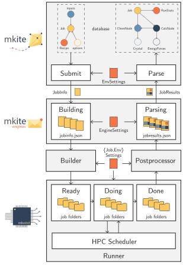
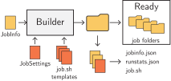
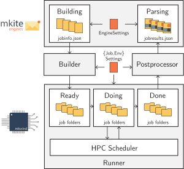

===========================
Using mkwind to manage jobs
===========================

Following the :doc:`installation tutorial <../setup/configs>` from mkwind, we can use the client command to manage jobs in the local computing resource.
The mkwind daemon offers three main functionalities:

- ``build``, which parses information for jobs to be executed from the engine and builds it locally on the filesystem, according to the :doc:`configuration file <../setup/configs>`.
- ``run``, which takes jobs which have been built and submits them to the queue.
- ``postprocess``, which takes the completed jobs, archives the raw files, and submits the results to the queue.

The integration between mkwind, the engine, and the mkite database is shown in the following figure:

In this tutorial, we will use each of the commands to manage jobs in a client worker.

Job structure
-------------

As mentioned in previous sections, the ``mkwind`` daemons do not have access to the production database.
Instead, they monitor an engine implemented by the ``mkite_engines`` package. 
Therefore, jobs come from an external source to be executed locally.

However, creating a job for local execution also requires a local engine.
In this case, the ``mkite_engines.LocalEngine`` allows the use of filesystem directories as an additional engine.
This creates a few folders in a selected path that will be monitored for job building, running, and post-processing.

Building jobs
-------------

As explained in the quickstart guide, information to build jobs can be created using a JobInfo object.
This information can be passed around as a simple JSON file, and is often what is found in an instance of ``mkite_engines``.
Instead of setting up an engine, in this example we will create a JobInfo very similar to the one in the quickstart, and use it to build a job to be submitted to an HPC scheduler or similar.

First, create a JSON file named ``jobinfo.json`` that contains the same information as the one from the tutorial:

.. code-block:: json
    :caption: ``jobinfo.json``
   
    {
        "job": {"uuid": "75879e52-4bc6-4623-9f91-2721db0aa7c9"},
        "recipe": {"name": "conformer.generation"},
        "inputs": [
            {"smiles": "Cn1c(=O)c2c(ncn2C)n(C)c1=O"}
        ],
        "options": {"force_field": "mmff"}
    }

Then, make sure your :doc:`config file for mkwind <../setup/configs>` can build a job of recipe ``conformer.generation``.
One example of a configuration file named ``cluster1.yaml`` would be:

.. code-block:: yaml
    :caption: ``cluster1.yaml``

    default:
      nodes: 1
      tasks_per_node: 36
      walltime: 24:00:00
      partition: pbatch
      account: acct
      pre_cmd: |
        source $HOME/.bashrc
        source $HOME/envs/mkite/bin/activate
      cmd: kite run
      post_cmd: |
        touch mkwind-complete

    conformer.generation:
      nodes: 1
      tasks_per_node: 1
      walltime: 30:00
      partition: pdebug
      cmd: kite run

Furthermore, if you do not have a configuration file for your system, you can create one following the instructions in the :doc:`configuring guide <../setup/configs>`:

.. code-block:: yaml
    :caption: ``settings.yaml``

    MAX_PENDING: 1
    MAX_RUNNING: 1
    MAX_READY: 1
    SCHEDULER: slurm
    LOG_PATH: ${_self_}/jobs
    BUILD_CONFIG: ${_self_}/../clusters/cluster1.yaml
    ENGINE_EXTERNAL: ${_self_}/../engines/global.yaml
    ENGINE_LOCAL: ${_self_}/../engines/local.yaml
    ENGINE_ARCHIVE: ${_self_}/../engines/archive.yaml

As an example, the settings above will build a job using the template for SLURM and the ``builder_config.yaml`` configuration file.
This means the ``conformer.generation`` job will be created using one node, one task per node, walltime of 30 min, and with the partition ``debug``.

Although the job could be built directly from an engine, we can use the ``build_one`` command to perform the same action for a given JobInfo file.
First, create the ``jobs`` folder. Then, execute the ``build_one`` command:

.. code-block:: bash

    mkdir jobs
    wind build_one -i jobinfo.json -s settings.yaml -d jobs

The command will build the job and create a folder called ``jobs/ready``, where the job and its scripts will be placed.
If a local engine had been set up (see section above), the job would have been placed directly on the folder that contains all jobs to be executed (thus, "ready").
Inside this folder, another folder will be created containing the name of the recipe (``conformer.generation``), the UUID of the job, and a timestamp.
The folder contains a ``job.sh`` script that should look like the following:

.. code-block:: bash
    :caption: ``job.sh``

    #!/bin/bash -l

    #SBATCH --nodes=1
    #SBATCH --ntasks-per-node=1
    #SBATCH --time=30:00
    #SBATCH --partition=pdebug
    #SBATCH --account=acct
    source $HOME/.bashrc
    source $HOME/envs/mkite/bin/activate

    kite run
    touch mkwind-complete

The job has now been created and is ready for submission.
If a single job is required, the ``job.sh`` file can be submitted with ``sbatch``.
Otherwise, the format is compatible with mkwind's ``run`` command, which we will use in the following section.

.. note::

    The only difference between the ``build_one`` and the ``build`` command is that the latter runs a loop that monitors the engine and the folder where jobs will be run. 
    The ``build`` command also ensures that the folder containing ``ready`` jobs is never filled with jobs, which would make job distribution uneven.

.. tip::

    The number of jobs that can be waiting to be submitted in the ``ready`` state is given in the mkwind settings with the ``MAX_READY`` entry.

Running jobs
------------

After a job has been built, it can be submitted for running.
The ``wind run`` command monitors the ``ready`` folder and the local job scheduler.
If deployed in a login node of an HPC cluster, the ``run`` daemon will monitor the pending jobs in the queue, and how many can be submitted for execution.  

Using the example configuration files above, we can create a runner daemon that uses the local folder specified at ``engines/local.yaml`` for job management.
This configuration file could be similar to:

.. code-block:: yaml
    :caption: ``engines/local.yaml``

    _module: mkite_engines.local
    root_path: $HOME/jobs
    move: True

Now, you can execute the ``run`` daemon as:

.. code-block:: bash

   wind run -s settings.yaml -l 60

This will create a folder ``$HOME/jobs`` where your jobs will be placed and monitored.
Furthermore, the daemon will be executed every 60 seconds to check whether more spaces in the queue are available.
If you want the daemon to run only once, execute it with a ``--sleep`` or ``-l`` argument equal or smaller than zero:

.. code-block:: bash

   wind run -s settings.yaml -l 0

.. note::

    In principle, you can add any job to the ``$HOME/jobs/ready`` folder and mkwind will take care of executing it for you.
    The only requisites are:

    1. The job is inside a folder
    2. The job folder contains a file called ``job.sh``

    Although the job will be executed, it may not be able to be postprocessed by mkwind if it does not follow the ``jobresults.json`` and ``jobinfo.json`` schemas.

Running locally
^^^^^^^^^^^^^^^

As local workstations often do not have a scheduler, the daemon does not check which resources are available when running jobs locally.
To bypass this problem, one can install a local scheduler like `pueue <https://github.com/Nukesor/pueue>`_, which offers excellent support for local job management.
Then, using mkwind to run jobs locally is just a matter of changing the ``settings.yaml`` to use the ``pueue`` daemon:

.. code-block:: yaml

   SCHEDULER: pueue

.. warning::

   Do not forget to run your ``pueued`` daemon to enable mkwind to interact with it.

Postprocessing jobs
-------------------

Once jobs are done, one can postprocess jobs executed with mkite's JobInfo schema and send the JobResults to the engine.
From there, the results can be parsed into mkite without the interference of the client worker.

Postprocessing jobs requires parsing the jobs from a queue with status ``done``, archiving the raw files, and sending the results to an engine.
Using the configuration files above, you can run the example job of conformer generation using ``mkwind``.
Then, with the settings in place, run the ``postprocess`` command:

.. code-block:: bash

   wind postprocess -s settings.yaml -l 0

This command will: 

1. Retrieve the job from the ``done`` folder (created by the local engine of mkwind's ``run`` daemon)
2. Process the results
3. Archive the result into an ``archive`` folder (also in the same directory, given the configuration file above)
4. Send the results to a ``parsing`` folder

You can check the contents of all folders and verify that the ``parsing`` folder has one JSON file corresponding to a serialized JobResults that can be parsed into the mkite database.

.. note::

   If the engine is different from the local one, the JobResults will be pushed to that engine.
   For example, if the selected engine was the Redis engine, we would see the result in the Redis database.
