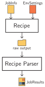

============================
Executing recipes with mkite
============================

Recipe in mkite were illustrated in the :doc:`15-min quickstart <quickstart>` guide. 
The conformer generation, just like any other recipe, takes a certain number of inputs and optional parameters and returns new results.
Any recipe works by converting the inputs into new outputs, be it in the form of property (CalcNodes) or new structures (ChemNode).
For example, a structure relaxation using DFT takes a single input and computes a new, relaxed structure (ChemNode) and the energy (CalcNode) of the relaxed structure (or a series of (structure, energy, forces), if a whole trajectory is stored).

Showing how recipes can be executed using mkite's API has been shown in the quickstart. 
If you are interested in developing new recipes, check the :doc:`advanced guide <../advanced/index>`.
