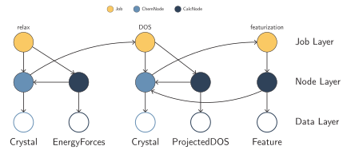

=============================
Creating workflows with mkite
=============================

Now that we learned how to create jobs in mkite, creating workflows is a simple extension of creating a single job.
In mkite, workflows can be created by concatenating several jobs according to their recipes, projects, and experiments.
Therefore, to create a workflow, one has to write a series of templates, as described in the `job creation <jobs>` guide.
There are multiple advantages to this:

- Jobs belonging to the same workflow can be distributed in heterogeneous computing environments.
- "Finite-state machine" database is synchronized in ``create`` and ``parse`` stages, thus avoiding concurrency problems with the production database.
- Bypasses the complexity of error handling or race conditions in different branches of the workflow
- Facilitates combinatorial workflow generation (e.g., several inputs in the same job)

Writing the template for a workflow
-----------------------------------

As discussed in the `mkite paper <https://doi.org/10.48550/arXiv.2301.08841>`_, workflows are simply concatenations of job specifications.
For example, in our previous example of conformer generation, we could attach other jobs to the conformers by adding an additional job specification to the YAML file:

.. code-block:: yaml
    :caption: ``01_conformers.yaml``

    # Creates the conformers
    - out_experiment: 01_conformers
      out_recipe: conformer.generation
      tags:
        - conformer
      options:
        num_conformers_returned: 1
      inputs:
        - filter:
            parentjob__experiment__name: 01_conformers
            parentjob__recipe__name: dbimport.MolFileImporter

    # Runs DFT calculation with a hypothetical recipe
    - out_experiment: 01_conformers
      out_recipe: dft.relax
      tags:
        - dft_relaxed
      inputs:
        - filter:
            parentjob__experiment__name: 01_conformers
            parentjob__recipe__name: conformer.generation

    # Performs MD simulations starting from the relaxed structure
    - out_experiment: 01_conformers
      out_recipe: dft.md
      tags:
        - dft_md
      inputs:
        - filter:
            parentjob__experiment__name: 01_conformers
            parentjob__recipe__name: dft.relax

.. important::

   Although the recipes above are hypothetical, you can implement the relevant recipes of your interest for any input/output.

With this type of workflow, defining experiments is a requirement.
This not only organizes the database, but enables different branches to be constructed.
For example, if the conformers above are used as an input for other downstream jobs, they should be specified as new inputs.

.. note::
   Larger, complex workflows can be created by writing several files such as the ``01_conformers.yaml`` above.
   Then, several branches of the workflow can be updated by using the ``create_from_file`` command several times.

Workflows with multiple inputs
------------------------------

Workflows can also be created for systems with multiple inputs.
For example, the mkite paper shows how to create adsorption jobs for catalysts by combining crystals and conformers in a single job:

.. code-block:: yaml
    :caption: ``03_adsorption.yaml``

    # Job 1 of Joint branch
    # The filter selects post-relaxation Crystals with tag surface
    - out_experiment: 03_joint
      out_recipe: catalysis.adsorption
      inputs:
        - filter:
            parentjob__experiment__name: 01_crystals
            parentjob__recipe__name: vasp.rpbe.relax
            parentjob__tags__name: surface
        - filter:
            parentjob__experiment__name: 02_molecules
            parentjob__recipe__name: conformer.generation
      tags:
        - interface

    # Job 2 of Joint branch
    - out_experiment: 03_joint
      out_recipe: vasp.rpbe.relax
      inputs:
        - filter:
            parentjob__experiment__name: 03_joint
            parentjob__recipe__name: catalysis.adsorption
            parentjob__recipe__tags: interface
      tags:
        - interface

The job can then be created using the ``tuple`` job creator:

.. code-block:: bash

   kitedb create_from_file tuple 03_adsorption.yaml

Advanced input selection
------------------------

Filtering inputs can be performed with all metadata available in each ChemNode.
If additional information was passed in the ``attributes`` tags of the ChemNodes, one can use that to filter the information.
Tags can also be used for filtering the information, which offers the users another degree of control to select which inputs will be used in a specific job.
Although that increases the burden on the users (you have to be sure of what you are doing!), it also provides greater flexibility.

In addition to the ``filter`` options, mkite uses the Django ``exclude`` method to remove entries from a QuerySet.
Its syntax is identical to ``filter``, and allows one to remove inputs which are undesired for a given calculation.
