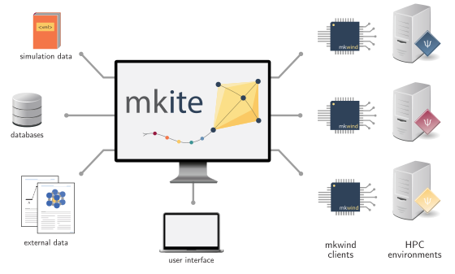

.. _about-main:

.. figure:: _img/mkite-logo.svg
    :align: center
    :alt: mkite logo
    :class: figtextwidth
    :width: 80%

===================
mkite documentation
===================

What is mkite?
--------------

mkite is a distributed computing platform for high-throughput materials simulations. The main idea of mkite is to decouple job management,and submission, and execution, enabling scaling jobs towards heterogenous computing environments. This infrastructure was designed particularly for the simulation of combinatorial materials spaces, including systems with coupling between different simulation workflows (say, crystal-molecule interfaces).

What mkite is designed for
--------------------------

The mkite toolkit is designed to interface existing packages in the context of high-throughput materials simulations. Given the vast number of excellent tools in the community, the goal is to minimize re-implementing different functionalities and leverage existing ones as much as possible. The mkite framework was designed to be similar to LLNL's `Merlin <https://github.com/LLNL/merlin>`_, which distributes simulations in various servers, but with a stronger focus on materials simulations.

mkite offers several possibilities in distributed job management, such as:

- *Isolating the main server from workers*, yet still keeping a record of all simulations in a production database. This is useful to prevent concurrency problems as the number of simulation scales up, as well as protects the main production server.
- *Creating complex workflows using file-based templates*, which can be applied to the main production database according to tags and job specifications.
- *Selective job building based on local specifications*, thus making the distribution of jobs driven by clients rather than handled by the main server. This enables higher efficiency in job management in high-throughput settings.
- *Executing jobs without any access to a database*, which can be performed by simply running scripts via the command line.

In addition, it provides common tools for high-throughput simulations, such as:

- Interface to schedulers, queues, and job submission.
- Data querying and post-processing using a Django interface to a PostgreSQL database.
- Data archiving and error handling.

Getting started
----------------------

To get started, you can read about :doc:`how mkite works <about/working>` in this documentation, or try the :doc:`15-min quickstart <basic/quickstart>` for practical examples.

Development
-----------

The mkite toolkit was developed by `Daniel Schwalbe-Koda <https://dskoda.com>`_ in the `Quantum Simulations Group <https://qsg.llnl.gov>`_ of the `Lawrence Livermore National Laboratory <https://www.llnl.gov>`_ (`PLS/MSD <https://pls.llnl.gov/research-and-development/materials-science>`_). Its initial implementation focused on parallelizing complex simulations workflows for materials science in the `Livermore Computing <https://hpc.llnl.gov/>`_ environment and its multiple platforms.

Released under the Apache 2.0 (with LLVM exception) License.

LLNL-CODE-848161

Documentation released as LLNL-WEB-848349.

.. toctree::
    :caption: About
    :maxdepth: 0
    :hidden:

    How it works <about/working>
    References <about/citing>
    License <about/license>

.. toctree::
    :caption: Setting up
    :maxdepth: 1
    :hidden:

    Installation <setup/index>
    Configuring <setup/configs>

.. toctree::
    :caption: Basic guide
    :maxdepth: 1
    :hidden:

    15-min quickstart <basic/quickstart>
    Tutorial <basic/index>

.. toctree::
    :caption: Advanced guide
    :maxdepth: 1
    :hidden:

    Tutorial <advanced/index>
